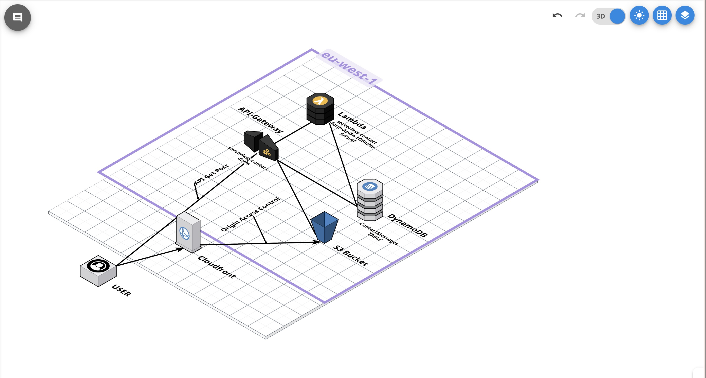
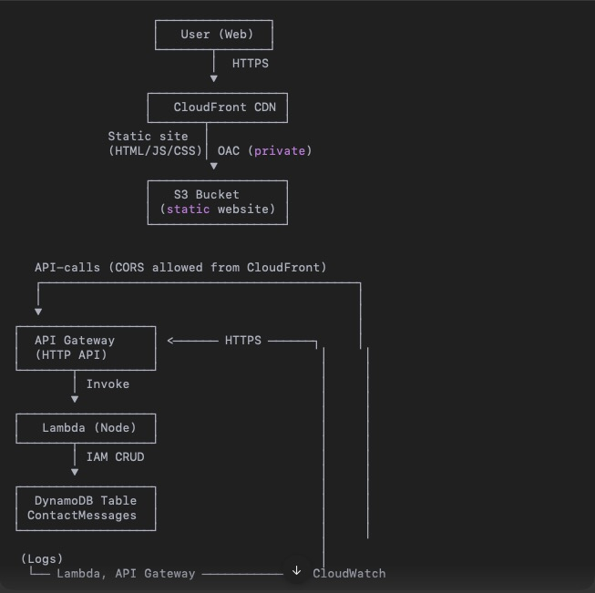
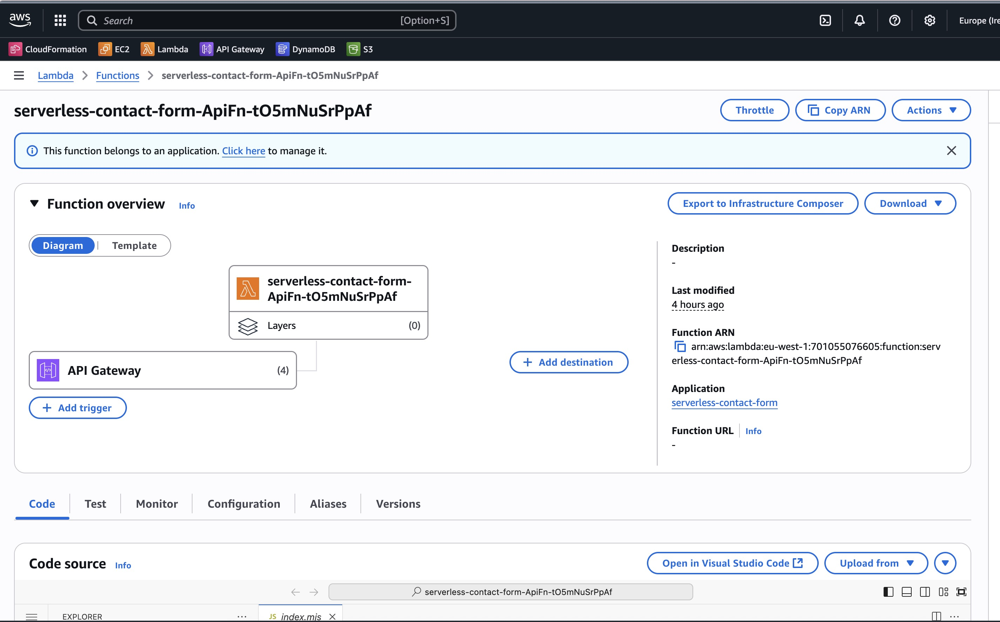
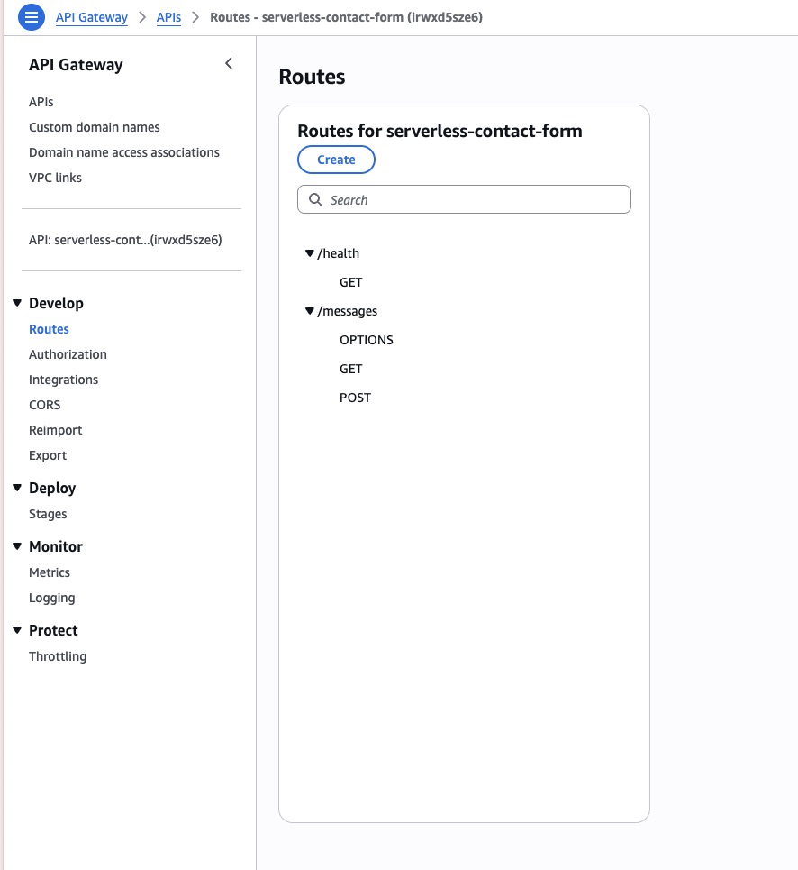
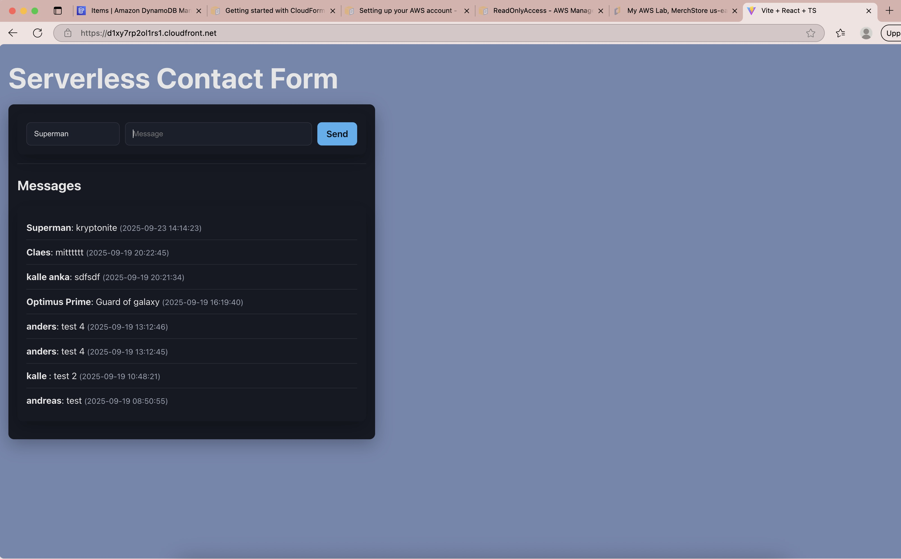
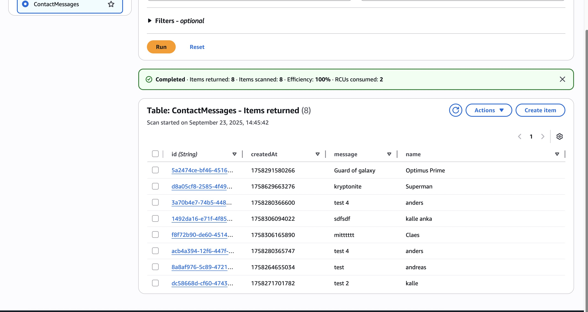

# Serverless Contact Form – Projektrapport

## Introduktion

Denna rapport är en sammanfatting av alla delar som jag gjorde när jag skapade **Serverless Contact Form**, en serverlös webbapplikation byggd i AWS. Projektets mål var en IAC lösning och ett helt serverlöst arbetsflöde som kan leverera ett interaktivt kontaktformulär med minimala driftkostnader kanske en mer realistisk lösning om man har en liten budget. Formuläret gör det möjligt för användare att skicka meddelanden som lagras i DynamoDB och visas i en lista distribuerat via CloudFront. Rapporten redovisar mina väg till mål eller så långt som jag kom i arbetet, beslutsunderlag och praktiska lärdomar som uppstod under arbetets gång.

## Mål och omfattning

- Tillhandahålla ett kontaktformulär utan serveradministration med automatisk skalning.
- Distribuera frontenden globalt för låg svarstid och hög tillgänglighet.
- Dokumentera dataflöde, kodkomponenter och visuella verifieringar från AWS-konsolen.

## Genomförande steg för steg

1. **Förberedelser.** Installerade AWS SAM CLI och verifierade AWS-profilerna för att kunna skapa resurser i `eu-west-1` utan att använda root-nycklar.
2. **Initial backend-skiss.** Körning av `sam init` genererade första versionen av `template.yaml`. Efter att ha läst att en variation av best praxis för var att använda Fargate skapades projektet på nytt som klassisk Lambda för att undvika containerberoende på Mac M1.
3. **Infrastruktur som kod.** Uppdaterade `template.yaml` för att definiera DynamoDB-tabell, Lambda och HTTP API-triggers, samt `samconfig.toml` för återkommande deployparametrar.
4. **Lambda-implementation.** Skrev logiken i `lambda/index.mjs` för CORS, validering och DynamoDB-åtkomst. Testade lokalt med `sam local start-api` och justerade tills JSON-formatet fungerade.
   Tog lång tid att felsöka de problem som uppstod med cors innan jag löste problemet.
5. **Frontend.** Scaffoldade en React/Vite-app i `frontend/`, byggde `MessageForm`, `MessageList` och API-klienten som använder bas-URL:en från SAM-utdata. Formuläret är till för att kunna skicka data till en databas i backend med hjälp av backend kod.
6. **Static hosting-infra.** Beskrev S3 + CloudFront med Origin Access Control i `infra-frontend.yaml` för en privat bucket bakom CDN med SPA-fallback. S3 = lagrar filerna (HTML, CSS, JS, bilder). CloudFront = distribuerar filerna globalt via ett Content Delivery Network (CDN) för snabbare laddning. och fungerar även som ett säkerhetslager och skyddar så användare aldrig pratar direkt med S3.
7. **Deploy & verifiering.** Kör `sam build && sam deploy` för backend, `npm run build` följt av `aws s3 sync` och CloudFront-invalidation för frontend, och bekräftade resultatet via Consolen i AWS.

## Arkitekturöversikt

Systemet använder en helt serverlös arkitektur visualiserad i figuren nedan. Användaren når webbappen via CloudFront som hämtar statiska filer från en S3-bucket skyddad av Origin Access Control. Formulärposter skickas till API Gateway som proxar vidare till Lambda, där logik körs mot DynamoDB-tabellen `ContactMessages`. Eventuella svar går tillbaka samma väg, vilket ger ett robust request–response-flöde utan att en enda EC2-instans behöver provisioneras.





Distribueringen sker i region `eu-west-1` för att minimera långa laddtider mot de tänkta användarna i Europa. Kombinationen av global CloudFront-cache och `PAY_PER_REQUEST` på DynamoDB innebär att driftkostnaderna är direkt kopplade till faktiskt nyttjande och skalningen i serverlesslösningen sker helt automatiskt via Lambda och DynamoDB.

## Infrastruktur som kod

AWS SAM beskriver infrastrukturen i `template.yaml:1`.

- `template.yaml:12` definierar DynamoDB-tabellen med hashnyckel `id` och `BillingMode: PAY_PER_REQUEST`.
- `template.yaml:19` låser tabellens attributdefinition till strängar vilket förenklar klientvalidering. att det bara var 2 input fält förenklade även ett sånt beslut. vilket innebär
  konsekvent dataformat mellan klient och databas
- `template.yaml:24` skapar Lambda-funktionen `ApiFn` med Node.js 20, 256 MB minne och miljövariabeln `TABLE_NAME`.
- `template.yaml:43` konfigurerar HTTP API-evenemang för `/health`, `/messages` (GET/POST) samt `OPTIONS` för CORS.
- `template.yaml:55` exporterar bas-URL:en för åtkomst efter `sam deploy`.

Mallen möjliggör reproducerbara driftsättningar och least-privilege genom inbyggd `DynamoDBCrudPolicy`.

```yaml
# template.yaml (utdrag)
Resources:
  Table:
    Type: AWS::DynamoDB::Table
    Properties:
      BillingMode: PAY_PER_REQUEST
      AttributeDefinitions:
        - AttributeName: id
          AttributeType: S
      KeySchema:
        - AttributeName: id
          KeyType: HASH
  ApiFn:
    Type: AWS::Serverless::Function
    Properties:
      Runtime: nodejs20.x
      Environment:
        Variables:
          TABLE_NAME: !Ref TableName
      Policies:
        - DynamoDBCrudPolicy:
            TableName: !Ref TableName
```

Under utvecklingen användes `sam build` för att paketera Lambda-koden och `sam deploy --guided` för att skapa IAM-resurser. Konfiguration sparades i `samconfig.toml`, vilket gav en smidig repeat-deploy utan att behöva svara på samma frågor flera gånger.

## Backend (Lambda)

Affärslogiken ligger i `lambda/index.mjs:1`.

- `lambda/index.mjs:12` initierar `DynamoDBDocumentClient` och basheaders för CORS.
- `lambda/index.mjs:18` hanterar `OPTIONS`-anrop och returnerar 204 för preflight.
- `lambda/index.mjs:24` svarar på `GET /health` med tidsstämpel för övervakning.
- `lambda/index.mjs:30` skannar tabellen, sorterar poster på `createdAt` och returnerar JSON.
- `lambda/index.mjs:41` validerar inkommande POST-data, skapar `id` via `crypto.randomUUID()` och sparar med `PutCommand`.
- `lambda/index.mjs:68` fångar okända rutter och `lambda/index.mjs:73` loggar och returnerar 500 vid fel.

Skärmdumpen nedan visar funktionen `serverless-contact-form-ApiFn` kopplad till fyra API Gateway-triggers.





I utvecklingsmiljön kördes funktionen lokalt med `sam local start-api`, vilket speglar API Gateway-beteendet. Därigenom kunde JSON-svar och statuskoder verifieras innan deploy. För felsökning användes `console.error` i kombination med CloudWatch Logs, vilket tydliggjorde exempelvis tidiga `SerializationException` när payload-formen inte matchade tabellens schema.

```javascript
// lambda/index.mjs (utdrag)
const baseHeaders = {
  "Content-Type": "application/json",
  "Access-Control-Allow-Origin": "*",
  "Access-Control-Allow-Headers": "Content-Type",
  "Access-Control-Allow-Methods": "OPTIONS,GET,POST",
};

if (method === "POST" && path === "/messages") {
  const body = JSON.parse(event.body || "{}");
  const item = {
    id: crypto.randomUUID(),
    name: String(body.name ?? "").trim(),
    message: String(body.message ?? "").trim(),
    createdAt: Date.now(),
  };
  await ddb.send(new PutCommand({ TableName: TABLE, Item: item }));
  return { statusCode: 201, headers: baseHeaders, body: JSON.stringify(item) };
}
```

## Frontend (React + Vite)

Frontendkoden finns i `frontend/` och bundlas med Vite.

- `frontend/src/App.tsx:1` hämtar meddelanden via `listMessages`, hanterar `loading`/`error` och uppdaterar listan efter POST.
- `frontend/src/api/client.ts:1` kapslar Axios-anrop och använder `import.meta.env.VITE_API_BASE` för miljöstyrning.
- `frontend/src/components/MessageForm/MessageForm.tsx:1` tillhandahåller formuläret, trimning och inaktivering vid `disabled`.
- `frontend/src/components/MessageList/MessageList.tsx:1` renderar `Message`-poster och formaterar `createdAt` med `toLocaleString`.
- `frontend/src/styles/app.scss:1` importerar mixins och definierar layout; färgtemat ligger i `frontend/src/styles/_variables.scss:1` och kortdesignen i `frontend/src/styles/_mixins.scss:1`.

Produktionens utseende syns i bilden nedan, där den distribuerade SPA:n visar flera testposter och bekräftar att datumformatet anpassas till användarens locale.



En custom-hook (`frontend/src/hooks/useMessages.ts:1`) kapslar listning och skapande av meddelanden. Den används inte i slutversionen av `App`, men demonstrerar ett skalbart mönster för delad state-hantering och kan aktiveras om applikationen får fler komponenter.

```tsx
// frontend/src/App.tsx (utdrag)
const handleSubmit = async (name: string, message: string) => {
  setLoading(true);
  setError(null);
  try {
    await createMessage({ name, message });
    setMessages(await listMessages());
  } catch (error) {
    setError(error instanceof Error ? error.message : "Failed to send");
  } finally {
    setLoading(false);
  }
};

return (
  <div className="panel">
    <MessageForm onSubmit={handleSubmit} disabled={loading} />
    {error && <p className="error">{error}</p>}
    {loading && <div className="spinner" />}
    <MessageList items={messages} />
  </div>
);
```

## Databas

DynamoDB-tabellen `ContactMessages` driftas enligt `template.yaml:14` och verifieras i skärmdumpen nedan. Bilden visar attributen `id`, `createdAt`, `name` och `message`, vilket matchar datamodellen som både backend (`lambda/index.mjs:52`) och frontend (`frontend/src/api/client.ts:4`) använder.



Ett tidigt arkitekturbeslut var att lagra `createdAt` som epoch-millisekunder i stället för ISO-strängar. Det möjliggör snabb sortering i både backend (`lambda/index.mjs:33`) och frontend utan extra index. Om projektet växer kan en Global Secondary Index på exempelvis `name` läggas till via samma mall för att stödja filtrering eller sökfunktion.

## Drifts- och säkerhetsaspekter

- CloudFront Origin Access Control (se `images/Architecture.jpg`) skyddar S3-bucketen från direktåtkomst.
- `template.yaml:34` begränsar Lambda-behörigheter till CRUD mot just `ContactMessages`.
- CORS-hantering i `lambda/index.mjs:13` möjliggör säkra cross-origin-anrop för SPA.
- `GET /health`-endpoint (`lambda/index.mjs:24`) förenklar monitorering utan att exponera känslig data.
- Övervakning sker enklast via `sam logs -n ApiFn --stack-name serverless-contact-form --tail`, vilket streamar loggarna direkt från Lambda.
- Kostnaden hålls låg eftersom varje tjänst är pay-per-use (CloudFront, API Gateway, Lambda och DynamoDB on-demand) och därmed bara debiterar verkligt nyttjande.

Utöver detta loggas alla lyckade POST-anrop i CloudTrail eftersom IAM-rollen som SAM skapar spåras automatiskt. HTTPS är obligatoriskt via CloudFront-distributionen och statiska resurser kan versioneras genom `Cache-Control`-headers i S3, vilket planeras för nästa release.

## Driftsättning

Backend distribueras med AWS SAM och körs i två steg:

```bash
sam build
sam deploy --config-file samconfig.toml --resolve-s3 --no-confirm-changeset
```

`CorsOrigin` i `samconfig.toml` pekar på CloudFront-domänen så att API:t bara accepterar trafik från rätt ursprung.

Körningen av `sam build` skapar katalogen `.aws-sam/` lokalt. Den rymmer byggda Lambda-artefakter under `build/`, en cache som gör nästa build snabbare och en uppdaterad kopia av mallen där `CodeUri` pekar på de paketerade zip-filerna. Mappen är en ren arbetskopia för SAM och behöver inte versionshanteras.

Frontenden byggs lokalt och laddas upp till S3 med separata cacheinställningar för indexfilen och de versionerade bundlade filerna:

```bash
npm run build
aws s3 sync frontend/dist/ s3://<bucket>/ --delete --cache-control "public,max-age=31536000,immutable" --exclude "index.html"
aws s3 cp frontend/dist/index.html s3://<bucket>/index.html --cache-control "no-cache" --content-type "text/html"
aws cloudfront create-invalidation --distribution-id <DIST_ID> --paths "/*"
```

Cachepolicyn gör att `index.html` uppdateras direkt efter deploy, medan hashade assets kan ligga kvar länge i CloudFront utan att användarna drabbas av gamla filer.

## Testning och validering

- Manuell end-to-end-testning via CloudFront-URL, bekräftad i `images/Cloudfront.jpg`.
- DynamoDB-konsolen (`images/DynamoDB.jpg`) visar lagrade poster.
- Lambda-konsolen (`images/lambda.jpg`) verifierar bindningen till API Gateway och senaste deploy.
- Lokal utveckling med `npm run dev` och `sam local start-api` möjliggör snabb feedback.
- För regressionstestning används ett litet Postman-collection (ej incheckat) som kör `GET` och `POST` mot `/messages` efter varje deploy. Nästa steg är att automatisera den körningen i exempelvis GitHub Actions med hjälp av `newman`.

Vid behov kan CORS verifieras manuellt från terminalen:

```bash
API="https://<api-id>.execute-api.eu-west-1.amazonaws.com"
ORIGIN="https://<cloudfront>.cloudfront.net"
curl -i -X OPTIONS "$API/messages" -H "Origin: $ORIGIN" -H "Access-Control-Request-Method: GET"
curl -i -H "Origin: $ORIGIN" "$API/messages"
```

## Utmaningar

- När projektet sattes upp med `sam init` satte den upp en Fargate-baserad variant som bygger en container för Intel-processorer. Min Mac med M1 (ARM) kunde inte starta den, så alla lokala kommandon tvärstannade. Vi gjorde därför om funktionen till den vanliga Lambda-modellen där koden laddas upp som ett zip-paket, och då fungerade utvecklingsflödet direkt.
- När frontenden testades första gången stoppades begäranden av webbläsarens CORS-skydd. Vi lade till de saknade svarshuvudena i `lambda/index.mjs:12`–`lambda/index.mjs:22`, vilket gav klartecken för både förfrågningar och formulärpostningar från webben.

## Fortsatt arbete

1. Lägg till autentisering, t.ex. Amazon Cognito, för att hindra spam och logga användare.
2. Implementera rate limiting eller reCAPTCHA för ytterligare skydd mot missbruk.
3. Upprätta CI/CD som kör tester och automatiserar `npm run build` + `sam deploy`.
4. Samla loggar och metriker i en CloudWatch-dashboard för bättre insyn.
5. Utöka frontenden med visuella bekräftelser (t.ex. toasts) och lazy loading av äldre meddelanden för att hantera större dataset.
6. uppdatera Cors till ännu säkrare production mode.

## Slutsats

Mitt projekt uppfyller förhoppningsvis kraven på uppgiften. Att leverera ett serverlöst kontaktformulär med minimal drift. Arkitekturen skalar automatiskt, koden är modulärt organiserad och infrastrukturen definieras som kod, vilket gör lösningen enkel att vidareutveckla och driftsätta i nya miljöer. Det har varit intressant och lärorikt att bygga miljöer och blanda frontend och devops i samma uppgift. mycket att ta in samtidigt men ändå kul att testa sig fram. Dock utmanande att att lösa de fel som uppstår och att hitta rätt lösning.
